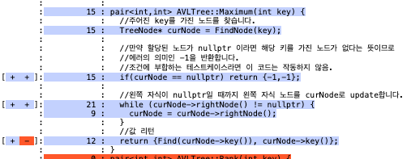
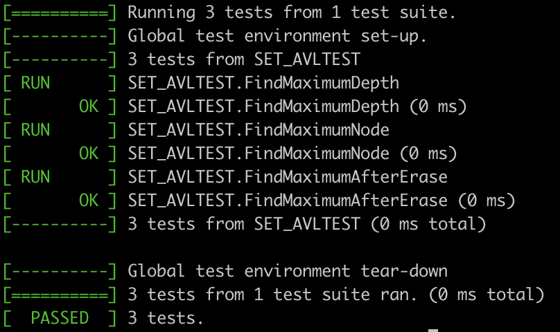
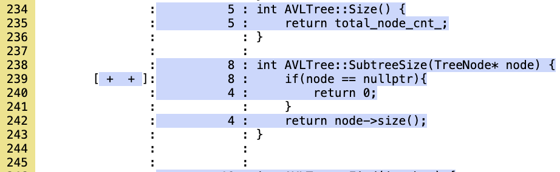
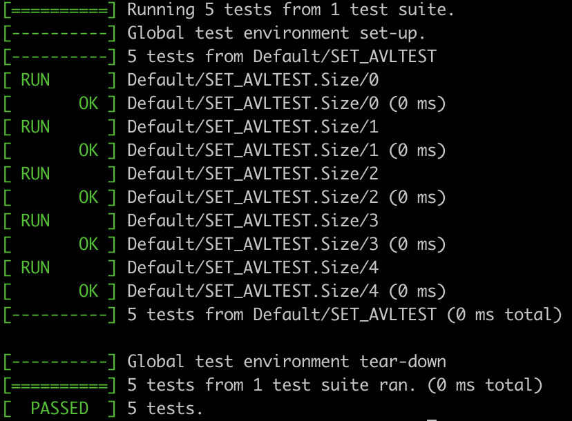
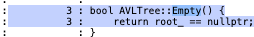
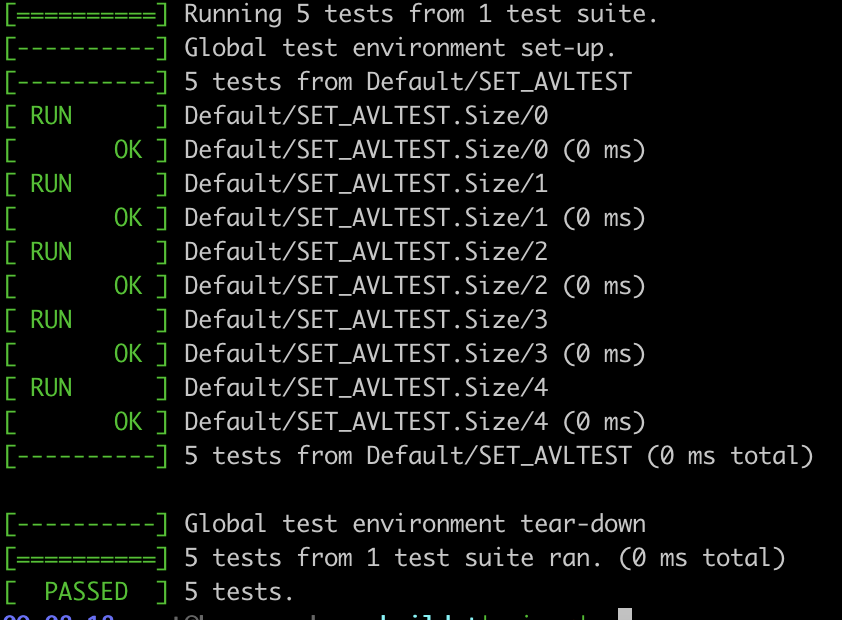

# Empty, size, maximum test 보고서

## Maximum Test

```cpp
TEST(SET_AVLTEST, FindMaximumDepth) {
  Set* avlTree = new AVLTree();
  vector<int> keys = {10,5,15,3,7};
  //AVL트리에 keys 삽입
  for(auto key : keys) avlTree->Insert(key);

  // Test the Maximum function
  EXPECT_EQ(avlTree->Maximum(10).first, 1);  // 10을 루트로 하는 서브트리의 depth는 1
  EXPECT_EQ(avlTree->Maximum(5).first, 2);  // 5를 루트로 하는 서브트리의 depth는 2
  EXPECT_EQ(avlTree->Maximum(15).first, 1);  // 15를 루트로 하는 서브트리의 depth는 1
  ASSERT_EQ(avlTree->Maximum(20).first, -1); // 20은 해당 트리에 존재하지 않기에 -1 반환
}

//Insert 후 Maximum Node
TEST(SET_AVLTEST, FindMaximumNode) {
  Set* avlTree = new AVLTree();
  vector<int> keys = {10,5,15,3,7};
  //AVL트리에 keys 삽입
  for(auto key : keys) avlTree->Insert(key);

  // Test the Maximum function
  EXPECT_EQ(avlTree->Maximum(10), make_pair(1,15));  // 10을 루트로 하는 서브트리의 Node는 (depth, Key)는 (1, 15)
  EXPECT_EQ(avlTree->Maximum(5), make_pair(2,7));  // 5를 루트로 하는 서브트리의 Node는 (depth, Key)는 (2,7)
  EXPECT_EQ(avlTree->Maximum(15), make_pair(1,15));  // 15를 루트로 하는 서브트리의 Node는 (depth, Key)는 (1, 15)
  EXPECT_EQ(avlTree->Maximum(3), make_pair(2,3));  // 3를 루트로 하는 서브트리의 Node는 (depth, Key)는 (2,3)
  EXPECT_EQ(avlTree->Maximum(7), make_pair(2,7));  // 7를 루트로 하는 서브트리의 Node는 (depth, Key)는 (2,7)
  ASSERT_EQ(avlTree->Maximum(20), make_pair(-1,-1)); // 20은 해당 트리에 존재하지 않기에 (-1,-1)이 반환
}

//삽입 및 삭제 연산 후 Maximum 노드
TEST(SET_AVLTEST, FindMaximumAfterErase) {
  Set* avlTree = new AVLTree();
  vector<int> keys = {10,5,15,3,7,12,18};
  for(auto key : keys) avlTree->Insert(key);  // AVL트리에 keys 삽입

  // Test the Maximum function
  EXPECT_EQ(avlTree->Maximum(3), make_pair(2,3));  // 3을 루트로 하는 서브트리의 (depth, Key)는 (2,3)
  EXPECT_EQ(avlTree->Maximum(10), make_pair(2,18));  // 10를 루트로 하는 서브트리의 (depth, Key)는 (2,18)
  EXPECT_EQ(avlTree->Maximum(15), make_pair(2,18));  // 15를 루트로 하는 서브트리의 (depth, Key)는 (2,18)

  avlTree->Erase(3); // AVL 트리에서 3을 키로 가진 노드 삭제
  EXPECT_EQ(avlTree->Maximum(10), make_pair(2,18)); //10을 루트로 하는 서브트리의 Maximum노드는 3에서 2로 변경
  ASSERT_EQ(avlTree->Maximum(3), make_pair(-1,-1)); //삭제된 3은 찾을 수 없다.
}

int main(int argc, char **argv){
  testing::InitGoogleTest(&argc, argv);
  return RUN_ALL_TESTS();
}
```

### Code Coverage



### Test Result



## size Test

```cpp
// 값이 매개변수화된 테스트 Fixture 클래스 정의
class SET_AVLTEST : public ::testing::TestWithParam<std::vector<int>>{
 protected:
  Set* avltree;

  void SetUp() override{
    avltree = new AVLTree();
  }

  void TearDown() override{
    delete avltree;
  }
};

// 테스트 케이스 정의
TEST_P(SET_AVLTEST, Size){
  for(int key : GetParam()){
    avltree->Insert(key);
  }
  // GetParam().size()는 삽입된 요소의 수와 일치
  ASSERT_EQ(GetParam().size(), avltree->Size());
}

// 테스트에 이용할 데이터 세트를 정의
std::vector<std::vector<int>> testDatasets = {
    {},                 // 비어 있는 트리
    {10},               // 하나의 요소를 삽입
    {10, 20},           // 두 개의 요소를 삽입
    {10, 20, 30},       // 세 개의 요소를 삽입
    {10, 20, 30, 40}    // 네 개의 요소를 삽입
};

// 테스트 데이터를 테스트 케이스에 전달
INSTANTIATE_TEST_SUITE_P(
    Default,
    SET_AVLTEST,
    ::testing::ValuesIn(testDatasets)
);

int main(int argc, char **argv){
  testing::InitGoogleTest(&argc, argv);
  return RUN_ALL_TESTS();
}
```

### Code Coverage



### Test Result



## empty Test

```cpp
// Fixture 클래스 정의
class SETAVL_TEST : public ::testing::Test{
 protected:
  Set* avltree;

  void SetUp() override {
    avltree = new AVLTree();
  }

  void TearDown() override {
    delete avltree;
  }
};

// 트리가 처음에 비어 있는지 테스트
TEST_F(SETAVL_TEST, InitiallyEmpty){
  EXPECT_TRUE(avltree->Empty());
}

// 트리에 요소를 추가한 후 비어 있지 않은지 테스트
TEST_F(SETAVL_TEST, NotEmptyAfterInsertion){
  avltree->Insert(10);
  EXPECT_FALSE(avltree->Empty());
}

// 트리에 요소를 추가하고 삭제한 후 다시 비어 있는지 테스트
TEST_F(SETAVL_TEST, EmptyAfterErase){
  avltree->Insert(10);
  avltree->Erase(10);
  EXPECT_TRUE(avltree->Empty());
}

int main(int argc, char **argv){
  testing::InitGoogleTest(&argc, argv);
  return RUN_ALL_TESTS();
}
```

### Code Coverage



### Test Result

