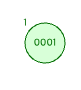

# EraseTest 보고서

[https://www.cs.usfca.edu/~galles/visualization/AVLtree.html](https://www.cs.usfca.edu/~galles/visualization/AVLtree.html)

해당 사이트를 활용해 노드 추가후 삭제 연산을 진행하면서 Depth를 파악해 TestCase를 작성하였다.

## EraseTest0

erase 1



기본 삭제 연산 Test 코드

```cpp
TEST(SET_AVLTEST,eraseTest0){

  vector<int> insertkeys = {1};

  vector< pair<int,int> > keys = {{1,0}};
  Set* avltree = new AVLTree();

  for(auto key : insertkeys){
    avltree->Insert(key);
  }

  for(auto key : keys) {
    ASSERT_EQ(key.second, avltree->Erase(key.first));
  }
}
```

## EraseTest1

erase 2


존재하지 않는 노드 삭제 연산 Test 코드

```cpp
TEST(SET_AVLTEST,eraseTest1){

  vector<int> insertkeys = {1};

  vector< pair<int,int> > keys = {{2,0}};
  Set* avltree = new AVLTree();

  for(auto key : insertkeys){
    avltree->Insert(key);
  }

  for(auto key : keys) {
    ASSERT_EQ(key.second, avltree->Erase(key.first));
  }
}
```

## EraseTest2


초기 상태


5,3,2 순차 제거 후 모습


9 삭제후 모습

여러 삭제 연산

```cpp
TEST(SET_AVLTEST,eraseTest2){

  vector<int> insertkeys = {1,2,3,4,5,6,7,8,9,10};

  vector< pair<int,int> > keys = {{5,3},{4,0},{2,1},{9,2}};
  Set* avltree = new AVLTree();

  for(auto key : insertkeys){
    avltree->Insert(key);
  }

  for(auto key : keys) {
    ASSERT_EQ(key.second, avltree->Erase(key.first));
  }
}
```

## EraseTest3


초기상태


1 삭제 후 모습

커버리지 만족을 위한 테스트1

```cpp
TEST(SET_AVLTEST,eraseTest3){ // RR TEST

  vector<int> insertkeys = {1,2,3,4};

  vector< pair<int,int> > keys = {{1,1}};
  Set* avltree = new AVLTree();

  for(auto key : insertkeys){
    avltree->Insert(key);
  }

  for(auto key : keys) {
    ASSERT_EQ(key.second, avltree->Erase(key.first));
  }
}
```

## EraseTest4


초기 모습


6 삭제후 연산

```cpp
TEST(SET_AVLTEST,eraseTest4){ // erase LR test

  vector<int> insertkeys = {5,6,1,3};

  vector< pair<int,int> > keys = {{6,1}};
  Set* avltree = new AVLTree();

  for(auto key : insertkeys){
    avltree->Insert(key);
  }

  for(auto key : keys) {
    ASSERT_EQ(key.second, avltree->Erase(key.first));
  }
}
```

## EraseTest5


초기 단계


중간 단계


최종 단계

```cpp
TEST(SET_AVLTEST,eraseTest5){

  vector<int> insertkeys = {10,9,8,7,6,5,4,3,2,1};

  vector< pair<int,int> > keys = {{8,2},{9,1},{2,1},{4,2},{3,1},{1,1}};
  Set* avltree = new AVLTree();

  for(auto key : insertkeys){
    avltree->Insert(key);
  }

  for(auto key : keys) {
    ASSERT_EQ(key.second, avltree->Erase(key.first));
  }
}
```

## 테스트 케이스의 대한 코드 커버리지 체크 모습


166번째 줄은 Erase함수 Find부분에서 check가 되므로 실행시킬 수 없다.

## 테스트 결과

