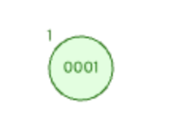
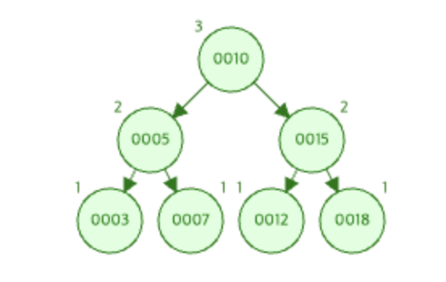
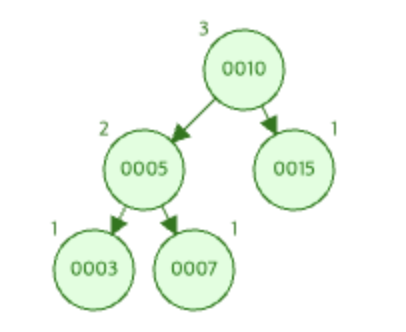
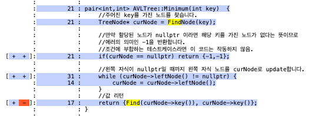
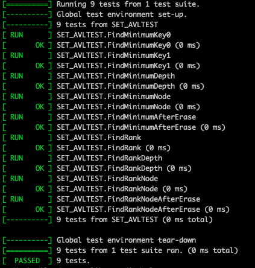

# MinimumTest 보고서

[https://www.cs.usfca.edu/~galles/visualization/AVLtree.html](https://www.cs.usfca.edu/~galles/visualization/AVLtree.html)

해당 사이트를 활용해 노드 추가후 삭제 연산을 진행하면서 Depth를 파악해 TestCase를 작성하였다.


## MinimumTest0
> **값을 하나만 Insert 후 Minumum의 키**
> 
> 
```cpp
TEST(SET_AVLTEST, minimumTest0) {
    Set* avlTree = new AVLTree();
    avlTree->Insert(1);  // 1 삽입

    // Test the Minimum function
    EXPECT_EQ(avlTree->Minimum(1).first, 0);
}
```


## MinimumTest1
> **여러 값 Insert 후 Minumum의 키**

```cpp
TEST(SET_AVLTEST, minimumTest1) {
    Set* avlTree = new AVLTree();
    vector<int> keys = {10,5,15,3,7,12,18};
    for(auto key : keys) avlTree->Insert(key);  // AVL트리에 keys 삽입

    // Test the Minimum function
    EXPECT_EQ(avlTree->Minimum(10).second, 3);  // 10을 루트로 하는 서브트리의 key는 3
    EXPECT_EQ(avlTree->Minimum(5).second, 3);    // 5를 루트로 하는 서브트리의 key는 3
    EXPECT_EQ(avlTree->Minimum(15).second, 12);  // 15을 루트로 하는 서브트리의 key는 12
    EXPECT_EQ(avlTree->Minimum(7).second, 7);  // 7을 루트로 하는 서브트리의 key는 7
    ASSERT_EQ(avlTree->Minimum(20).first, -1);   // 20은 해당 트리에 존재하지 않기에 -1 반환
}
```


## MinimumTest2
> **Insert 후 Minimum의 Depth**
> 
```cp
TEST(SET_AVLTEST, minimumTest2) {
    Set* avlTree = new AVLTree();
    vector<int> keys = {10,5,15,3,7};
    //AVL트리에 keys 삽입
    for(auto key : keys) avlTree->Insert(key);
    
    // Test the Minimum function
    EXPECT_EQ(avlTree->Minimum(10).first, 2);  // 10을 루트로 하는 서브트리의 depth는 2
    EXPECT_EQ(avlTree->Minimum(5).first, 2);  // 5를 루트로 하는 서브트리의 depth는 2
    EXPECT_EQ(avlTree->Minimum(15).first, 1);  // 15를 루트로 하는 서브트리의 depth는 1
    ASSERT_EQ(avlTree->Minimum(20).first, -1); // 20은 해당 트리에 존재하지 않기에 -1 반환
}
```

## MinimumTest3
> **Insert 후 Minimum Node**
> 
```cpp
TEST(SET_AVLTEST, minimumTest3) {
    Set* avlTree = new AVLTree();
    vector<int> keys = {10,5,15,3,7};
    //AVL트리에 keys 삽입
    for(auto key : keys) avlTree->Insert(key);
    
    // Test the Minimum function
    EXPECT_EQ(avlTree->Minimum(10), make_pair(2,3));  // 10을 루트로 하는 서브트리의 Node는 (depth, Key)는 (2,3)
    EXPECT_EQ(avlTree->Minimum(5), make_pair(2,3));  // 5를 루트로 하는 서브트리의 Node는 (depth, Key)는 (2,3)
    EXPECT_EQ(avlTree->Minimum(15), make_pair(1,15));  // 15를 루트로 하는 서브트리의 Node는 (depth, Key)는 (2,12)
    EXPECT_EQ(avlTree->Minimum(3), make_pair(2,3));  // 3를 루트로 하는 서브트리의 Node는 (depth, Key)는 (2,3)
    EXPECT_EQ(avlTree->Minimum(7), make_pair(2,7));  // 7를 루트로 하는 서브트리의 Node는 (depth, Key)는 (2,7)
    ASSERT_EQ(avlTree->Minimum(20), make_pair(-1,-1)); // 20은 해당 트리에 존재하지 않기에 (-1,-1)이 반환
}
```


## MinimumTest4
> **Insert 후 Minimum Node**
> 삽입 및 삭제 연산 후 Minimum 노드
> 
> keys 삽입 후 트리 모습
> 
> 
> key가 3인 노드 삭제 후 트리 모습
> 
```cpp
    TEST(SET_AVLTEST, minimumTest4) {
    Set* avlTree = new AVLTree();
    vector<int> keys = {10,5,15,3,7,12,18};
    for(auto key : keys) avlTree->Insert(key);  // AVL트리에 keys 삽입
    
    // Test the Minimum function
    EXPECT_EQ(avlTree->Minimum(3), make_pair(2,3));  // 3을 루트로 하는 서브트리의 (depth, Key)는 (2,3)
    EXPECT_EQ(avlTree->Minimum(10), make_pair(2,3));  // 10를 루트로 하는 서브트리의 (depth, Key)는 (2,3)
    EXPECT_EQ(avlTree->Minimum(15), make_pair(2,12));  // 15를 루트로 하는 서브트리의 (depth, Key)는 (2,12)
    
    avlTree->Erase(3); // AVL 트리에서 3을 키로 가진 노드 삭제
    EXPECT_EQ(avlTree->Minimum(10), make_pair(1,5)); //10을 루트로 하는 서브트리의 Minumum노드는 3에서 5로 변경
    ASSERT_EQ(avlTree->Minimum(3), make_pair(-1,-1)); //삭제된 3은 찾을 수 없다.
}
```


## 테스트 케이스에 대한 코드 커버리지 체크 모습


## 테스트 결과
