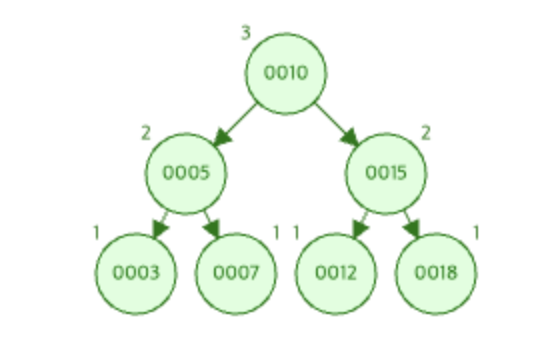

# RankTest 보고서

[https://www.cs.usfca.edu/~galles/visualization/AVLtree.html](https://www.cs.usfca.edu/~galles/visualization/AVLtree.html)

해당 사이트를 활용해 노드 추가후 삭제 연산을 진행하면서 Depth를 파악해 TestCase를 작성하였다.


## RankTest0
> **keys 삽입 후 rank**
>
> 
```cpp
TEST(SET_AVLTEST, rankTest0) {
    Set* avlTree = new AVLTree();
    vector<int> keys = {10,5,15,3,7,12,18};
    for(auto key : keys) avlTree->Insert(key);

    // Test the Rank function
    EXPECT_EQ(avlTree->Rank(10).second, 4);  // 10의 랭크는 4
    EXPECT_EQ(avlTree->Rank(3).second, 1);   // 3의 랭크는 1
    EXPECT_EQ(avlTree->Rank(18).second, 7);  // 18의 랭크는 7
    ASSERT_EQ(avlTree->Rank(20).first, -1); // 20은 해당 트리에 존재하지 않기에 -1 반환
}
```


## RankTest1
> **Insert 후 해당 노드의 깊이**

```cpp
TEST(SET_AVLTEST, rankTest1) {
    Set* avlTree = new AVLTree();
    vector<int> keys = {10,5,15,3,7,12,18};
    for(auto key : keys) avlTree->Insert(key);

    // Test the Rank function
    EXPECT_EQ(avlTree->Rank(10).first, 0);  // 10의 depth는 0
    EXPECT_EQ(avlTree->Rank(3).first, 2);   // 3의 depth는 2
    EXPECT_EQ(avlTree->Rank(18).first, 2);  // 18의 depth는 2
    ASSERT_EQ(avlTree->Rank(20).first, -1); // 20은 해당 트리에 존재하지 않기에 -1 반환
}
```


## RankTest2
> **Insert 후 각 노드의 depth, key
> 
```cp
TEST(SET_AVLTEST, rankTest2) {
    Set* avlTree = new AVLTree();
    vector<int> keys = {10,5,15,3,7,12,18};
    for(auto key : keys) avlTree->Insert(key);  //AVL트리에 keys 삽입

    // Test the Rank function
    EXPECT_EQ(avlTree->Rank(10), make_pair(0,4));  // 10의 (depth, rank)는 (0, 4)
    EXPECT_EQ(avlTree->Rank(3), make_pair(2,1)); // 3의 (depth, rank)는 (2, 1)
    EXPECT_EQ(avlTree->Rank(18), make_pair(2,7)); // 18의 (depth, rank)는 (2, 7)
    ASSERT_EQ(avlTree->Rank(20).first, -1); // 20은 해당 트리에 존재하지 않기에 -1반환
}
```

## RankTest3
> keys 삽입 후 트리 모습
> 
>
> key가 3인 노드 삭제 후 트리 모습
> 
```cpp
TEST(SET_AVLTEST, rankTest3) {
    Set* avlTree = new AVLTree();
    vector<int> keys = {10,5,15,3,7,12,18};
    for(auto key : keys) avlTree->Insert(key);

    // Test the Rank function
    EXPECT_EQ(avlTree->Rank(10).second, 4);  // 10의 랭크는 4
    EXPECT_EQ(avlTree->Rank(3).second, 1);   // 3의 랭크는 1
    EXPECT_EQ(avlTree->Rank(18).second, 7);  // 18의 랭크는 7

    avlTree->Erase(3); // AVL 트리에서 3을 키로 가진 노드 삭제
    EXPECT_EQ(avlTree->Rank(10).second, 3); //10을 루트로 하는 서브트리의 Rank 4->3으로 변경
    ASSERT_EQ(avlTree->Rank(3).second, 0); //삭제된 3은 찾을 수 없다.
}
```


## 테스트 케이스에 대한 코드 커버리지 체크 모습


## 테스트 결과
